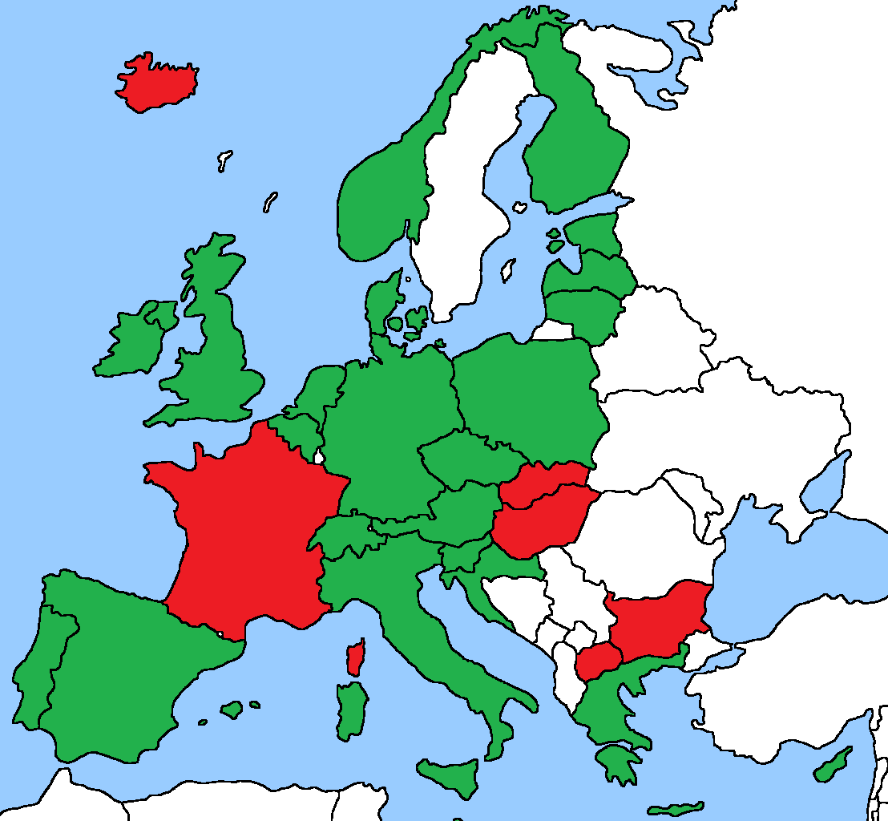

# Summary Europe

[**HOME**](https://github.com/ct-report/summary) | [Europe](https://github.com/ct-report/summary/blob/master/Europe.md) | [USA](https://github.com/ct-report/summary/blob/master/USA.md) | [Rest of the World](https://github.com/ct-report/summary/blob/master/ROTW.md)
-----|-----|------|-----

-------------------------------------

**European Contact-Tracing Apps for Android**

**October 6th, 2020 - snapshot** (update in progress)

- **EU Countries**

Country | Status | App Details
--------|--------|------------
Austria | Official (STOPP CORONA) | https://github.com/ct-report/AT
Belgium | Official (CORONALERT) | https://github.com/ct-report/BE
Bulgaria | Official (VIRUSAFE) | https://github.com/ct-report/BG
Croatia | Official (STOP COVID-19) | https://github.com/ct-report/HR |
Cyprus | Official (COVTRACER EN) | https://github.com/ct-report/CY
Czechia | Official (EROUSKA) | https://github.com/ct-report/CZ
Denmark | Official (SMITTESTOP) | https://github.com/ct-report/DK
Estonia | Official (HOIA) | https://github.com/ct-report/EE |
Finland | Official (KORONAVILLKU) | https://github.com/ct-report/FI
France | Official (STOPCOVID FRANCE) | https://github.com/ct-report/FR
Germany | Official (CORONA-WARN-APP) | https://github.com/ct-report/DE
Greece | Official (EXO) | https://github.com/ct-report/GR
Hungary | Official (VIRUSRADAR) | https://github.com/ct-report/HU
Ireland | Official (COVID TRACKER) | https://github.com/ct-report/IE
Italy | Official (IMMUNI) | https://github.com/ct-report/IT
Latvia | Official (APTURI COVID) | https://github.com/ct-report/LV
Lithuania | Official (KORONA STOP LT) | https://github.com/ct-report/LT
Luxembourg | n/a |
Malta | Official (COVID ALERT MALTA) | https://github.com/ct-report/MT
Netherlands | Official (CORONAMELDER) | https://github.com/ct-report/NL
Poland | Official (PROTEGO SAFE) | https://github.com/ct-report/PL
Portugal | Official (STAYAWAY COVID) | https://github.com/ct-report/PT
Romania | n/a |
Slovakia | Official (COVID19 ZOSTANZDRAVY) - DISABLED | https://github.com/ct-report/SK
Slovenia | Official (OSTANIZDRAV) | https://github.com/ct-report/SI
Spain | Official (RADAR COVID) | https://github.com/ct-report/ES
Sweden | n/a |

-------------------------------------

- **CH + EEA/non-EU Countries**

Country | Status | App Details
--------|--------|------------
Iceland | Official (RAKNING C-19) | https://github.com/ct-report/IS
Liechtenstein | Not taken into consideration (biometric electronic bracelets) |
Norway | Official (SMITTESTOPP) - SUSPENDEND -> GAEN development | https://github.com/ct-report/NO
Switzerland | Official (SWISSCOVID) | https://github.com/ct-report/CH

-------------------------------------

- **UK + Oversea Territories**

Country | Status | App Details
--------|--------|------------
England | Official (NHS COVID-19) | https://github.com/ct-report/UK
Northern Ireland | Official (STOPCOVID NI) | https://github.com/ct-report/UKNI
Scotland | Official (PROTECT SCOTLAND) | https://github.com/ct-report/UKSC
Wales | Official (NHS COVID-19) | https://github.com/ct-report/UK
Gibraltar | Official (BEAT COVID GIBRALTAR) | https://github.com/ct-report/GI

-------------------------------------

- **Other European Countries**

Country | Status | App Details
--------|--------|------------
North Macedonia | Official (STOPKORONA) | https://github.com/ct-report/MK

-------------------------------

- Contact-Tracing Frameworks

Name | Architecture | Details
-----|--------------|--------
GAEN Apple+Google | Decentralized | https://github.com/ct-report/GAEN
DP^3T | Decentralized | https://github.com/ct-report/DP-3T
PEPP-PT | Centralized | https://github.com/ct-report/PEPP-PT
TCN | Decentralized | https://github.com/ct-report/TCN
MIT PrivateKit | Decentralized | https://github.com/ct-report/MIT
OpenTrace | Centralized | https://github.com/ct-report/OPENTRACE

-------------------------------

Map showing current possibile backend interoperability / GAEN TEK feeds exchange ( _EU TEK Gateway will be available to EU countries since October 17th_ ):

Color | Description
------|------------
GREEN | GAEN support OK
RED | GAEN incompatible (because of centralized architecture and/or lack of BT)

