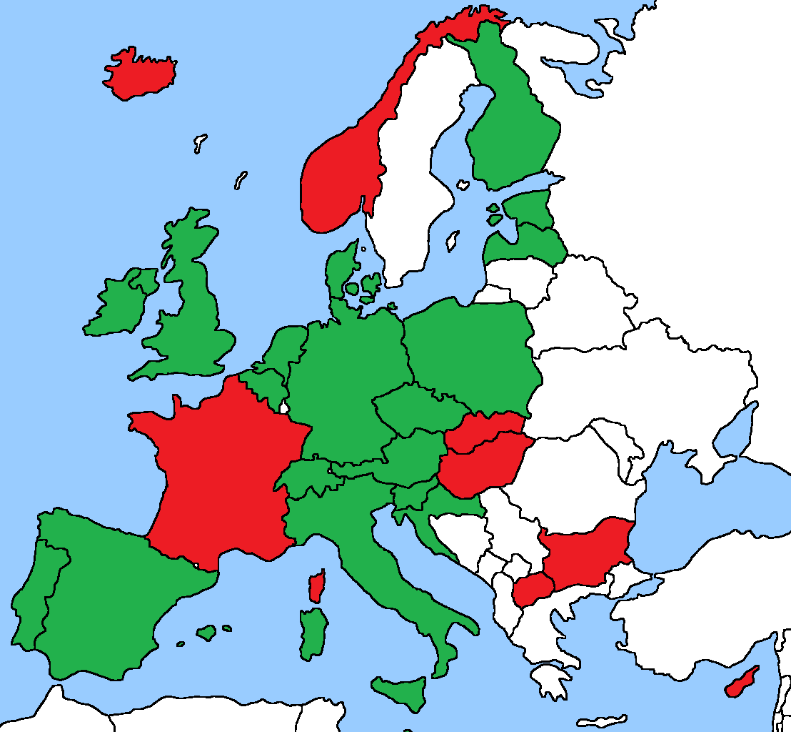

# Summary

Area | Details
-------|-----------------------------------------------------------
Europe | https://github.com/ct-report/summary/blob/master/Europe.md
USA | https://github.com/ct-report/summary/blob/master/USA.md
Rest of the World | https://github.com/ct-report/summary/blob/master/ROTW.md

**European Contact-Tracing Apps for Android**

**October 6th, 2020 - snapshot** (update in progress)

- EU Countries

Country | Status | App Details
--------|--------|------------
Austria | Government Official (STOPP CORONA) | https://github.com/ct-report/AT
Belgium | Government Official (CORONALERT) | https://github.com/ct-report/BE
Bulgaria | Government Official (VIRUSAFE) | https://github.com/ct-report/BG
Croatia | Government Official (STOP COVID-19) | https://github.com/ct-report/HR |
Cyprus | Government Official (COVTRACER) | https://github.com/ct-report/CY
Czechia | Government Official (EROUSKA) | https://github.com/ct-report/CZ
Denmark | Government Official (SMITTESTOP) | https://github.com/ct-report/DK
Estonia | Government Official (HOIA) | https://github.com/ct-report/EE |
Finland | Government Official (KORONAVILLKU) | https://github.com/ct-report/FI
France | Government Official (STOPCOVID FRANCE) | https://github.com/ct-report/FR
Germany | Government Official (CORONA-WARN-APP) | https://github.com/ct-report/DE
Greece | n/a |
Hungary | Government Official (VIRUSRADAR) | https://github.com/ct-report/HU
Ireland | Government Official (COVID TRACKER) | https://github.com/ct-report/IE
Italy | Government Official (IMMUNI) | https://github.com/ct-report/IT
Latvia | Government Official (APTURI COVID) | https://github.com/ct-report/LV
Lithuania | n/a |
Luxembourg | n/a |
Malta | Government Official (COVID ALERT MALTA) | https://github.com/ct-report/MT
Netherlands | Government Official (CORONAMELDER) | https://github.com/ct-report/NL
Poland | Government Official (PROTEGO SAFE) | https://github.com/ct-report/PL
Portugal | Government Official (STAYAWAY COVID) | https://github.com/ct-report/PT
Romania | n/a |
Slovakia | Government Official (COVID19 ZOSTANZDRAVY) | https://github.com/ct-report/SK
Slovenia | Government Official (OSTANIZDRAV) | https://github.com/ct-report/SI
Spain | Government Official Country (RADAR COVID) | https://github.com/ct-report/ES
Sweden | n/a |

- CH + EEA/non-EU Countries

Country | Status | App Details
--------|--------|------------
Iceland | Government Official (RAKNING C-19) | https://github.com/ct-report/IS
Liechtenstein | Not taken into consideration (biometric electronic bracelets) |
Norway | Government Official (SMITTESTOPP) - SUSPENDEND SINCE 06/16 | https://github.com/ct-report/NO
Switzerland | Government Official (SWISSCOVID) | https://github.com/ct-report/CH

- UK + Oversea Territories

Country | Status | App Details
--------|--------|------------
England | Government Official (NHS COVID-19) | https://github.com/ct-report/UK
Northern Ireland | Government Official (STOPCOVID NI) | https://github.com/ct-report/UKNI
Scotland | Government Official (PROTECT SCOTLAND) | https://github.com/ct-report/UKSC
Wales | Government Official (NHS COVID-19) | https://github.com/ct-report/UK
Gibraltar | Government Official (BEAT COVID GIBRALTAR) | https://github.com/ct-report/GI
-------------------------------

- Other European Countries

Country | Status | App Details
--------|--------|------------
North Macedonia | Government Official (STOPKORONA) | https://github.com/ct-report/MK

- European Frameworks

Name | Architecture | Details
-----|--------------|--------
DP^3T | Decentralized | https://github.com/ct-report/DP-3T
PEPP-PT | Centralized | https://github.com/ct-report/PEPP-PT

- Other Frameworks

Name | Architecture | Details
-----|--------------|--------
TCN | Decentralized | https://github.com/ct-report/TCN
MIT PrivateKit | Decentralized | https://github.com/ct-report/MIT
OpenTrace | Centralized | https://github.com/ct-report/OPENTRACE

- Apple+Google Exposure Notifications API

Name | Details
-----|--------
GAEN | https://github.com/ct-report/GAEN

-------------------------------

Map showing current possibile backend interoperability / GAEN TEK feeds exchange :

Color | Description
------|------------
GREEN | GAEN support OK
RED | GAEN incompatible (because of centralized architecture and/or lack of BT)

