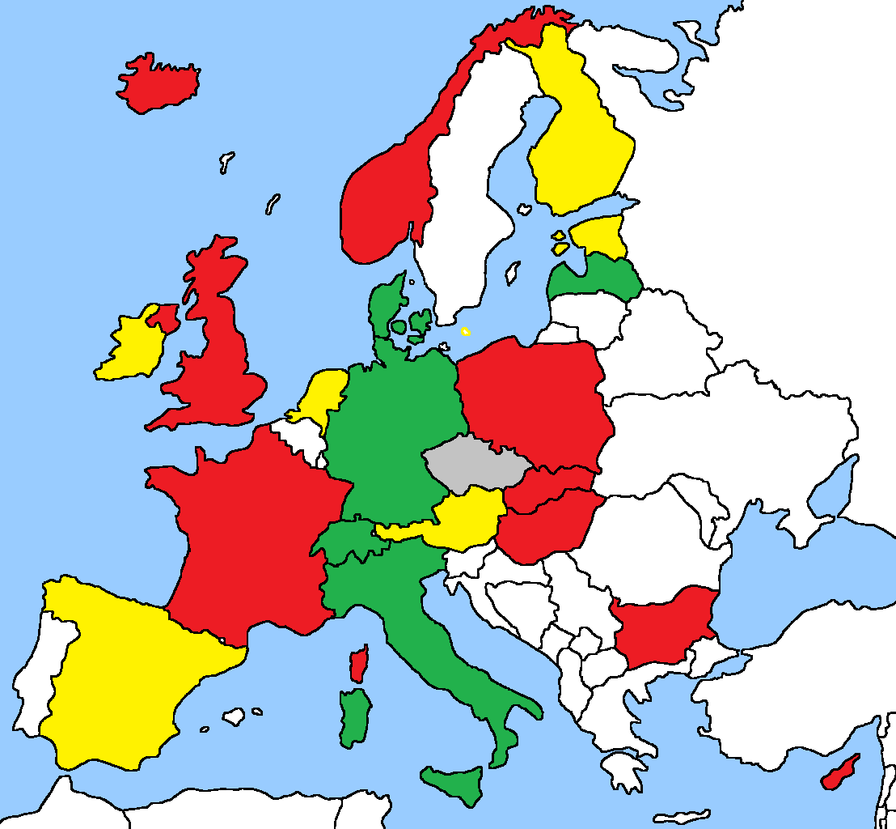

# Summary

**European (EEA + CH + UK) Contact-Tracing Apps for Android**

**June 18, 2020 - snapshot** (update in progress)

- EU Countries

Country | Status | App Details
--------|--------|------------
Austria | Government Official (STOPP CORONA) | https://github.com/ct-report/AT
Belgium | Cancelled Program - re-evaluating Sciensano proposal |
Bulgaria | Government Official (VIRUSAFE) | https://github.com/ct-report/BG
Croatia | In Development (formerly Not taken into consideration) |
Cyprus | Government Official (COVTRACER) | https://github.com/ct-report/CY
Czechia | Government Official (EROUSKA) | https://github.com/ct-report/CZ
Denmark | Government Official (SMITTESTOP) | https://github.com/ct-report/DK
Estonia | In development (DP^3T based) |
Finland | In development (KETJU) - Pilot-test | https://github.com/ct-report/FI
France | Government Official (STOPCOVID FRANCE) | https://github.com/ct-report/FR
Germany | Government Official (CORONA-WARN-APP) | https://github.com/ct-report/DE
Greece | n/a |
Hungary | Government Official (VIRUSRADAR) | https://github.com/ct-report/HU
Ireland | In development (CovidTracker Ireland App) |
Italy | Government Official (IMMUNI) | https://github.com/ct-report/IT
Latvia | Government Official (APTURI COVID) | https://github.com/ct-report/LV
Lithuania | n/a |
Luxembourg | n/a |
Malta | n/a |
Netherlands | In development (DP^3T based) after cancelled Appathon | https://github.com/ct-report/NL
Poland | Government Official (PROTEGO SAFE) | https://github.com/ct-report/PL
Portugal | In Development (monitorCovid19 PT - DP^3T based) |
Romania | n/a |
Slovakia | Government Official (COVID19 ZOSTANZDRAVY) | https://github.com/ct-report/SK
Slovenia | n/a |
Spain | In development (DP^3T based) - Canary Islands Pilot-test |
Sweden | n/a |

- CH + UK + EEA/non-EU Countries

Country | Status | App Details
--------|--------|------------
Iceland | Government Official (RAKNING C-19) | https://github.com/ct-report/IS
Liechtenstein | Not taken into consideration (biometric electronic bracelets) |
Norway | Government Official (SMITTESTOPP) - SUSPENDEND SINCE 06/16 | https://github.com/ct-report/NO
Switzerland | Government Official (SWISSCOVID) | https://github.com/ct-report/CH
United Kingdom | Government Official (NHS COVID-19) - switching to GAEN | https://github.com/ct-report/UK

-------------------------------

- European Frameworks

Name | Architecture | Details
-----|--------------|--------
DP^3T | Decentralized | https://github.com/ct-report/DP-3T
PEPP-PT | Centralized | https://github.com/ct-report/PEPP-PT

- Other Frameworks

Name | Architecture | Details
-----|--------------|--------
TCN | Decentralized | https://github.com/ct-report/TCN
MIT PrivateKit | Decentralized | https://github.com/ct-report/MIT
OpenTrace | Centralized | https://github.com/ct-report/OPENTRACE

- Apple+Google Exposure Notifications API

Name | Details
-----|--------
GAEN | https://github.com/ct-report/GAEN

-------------------------------

Map showing current possibile backend interoperability / GAEN TEK feeds exchange :

Color | Description
------|------------
GREEN | GAEN support OK
YELLOW | GAEN support in development
GRAY | decentralized that could support GAEN 
RED | incompatible (because of architecture or lack of BT)

