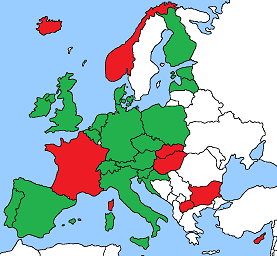
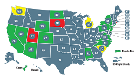

# Summary

**Contact-Tracing Apps for Android**

**October 6th, 2020 - snapshot** (work in progress)

Area | Map
-----|----
[Europe](https://github.com/ct-report/summary/blob/master/Europe.md) | 
[USA](https://github.com/ct-report/summary/blob/master/USA.md) | 
[Rest of the World](https://github.com/ct-report/summary/blob/master/ROTW.md) | .

-------------------------------

- Contact-Tracing Frameworks

Name | Architecture | Details
-----|--------------|--------
GAEN Apple+Google | Decentralized | https://github.com/ct-report/GAEN
DP^3T | Decentralized | https://github.com/ct-report/DP-3T
PEPP-PT | Centralized | https://github.com/ct-report/PEPP-PT
TCN | Decentralized | https://github.com/ct-report/TCN
MIT PrivateKit | Decentralized | https://github.com/ct-report/MIT
OpenTrace | Centralized | https://github.com/ct-report/OPENTRACE

-------------------------------

- Other app trackers/lists

Name | Link | References
-----|------|-----------
f1s0c131 Covid19 Tracker Apps | https://github.com/fs0c131y/covid19-tracker-apps | [Elliot Anderson on Twitter](https://twitter.com/fs0c131y)
MIT Technology Review Covid Tracing Tracker | https://docs.google.com/spreadsheets/d/1ATalASO8KtZMx__zJREoOvFh0nmB-sAqJ1-CjVRSCOw | [MIT Technology Review on Twitter](https://twitter.com/techreview)
XDA - Countries using GAEN API Framework | https://www.xda-developers.com/google-apple-covid-19-contact-tracing-exposure-notifications-api-app-list-countries | [XDA Developers on Twitter](https://twitter.com/xdadevelopers)
Wikipedia - List of CT Apps by Country | https://en.wikipedia.org/wiki/COVID-19_apps#List_of_apps_by_country | .

